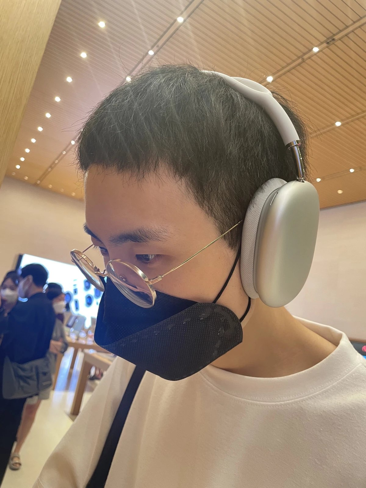

<h1>김 화겸</h1>
<h1>Hwakyeom Kim</h1>
<h3>just-do-halee</h3>
<h3>Doha Lee</h3>
 

<h5>

[애플(Apple) 매장에서]</h5>

 
 

 
 

# 생애

열두 살부터 C++, Visual Basic 6, WinAPI, DirectX, ... 등과 게임프로그래머의 꿈을 키우며 여러 개인 프로젝트들을 진행해 왔으나 돌연 스무살 시절 기타 요인들에 의해 다른 길로 전향, 이후 물리학, 수학, 철학 등 흥미 본위로 공부하였고 군복무 후 소설가의 길을 걷고자 수 년 간 소설, 시에 매진하였다. 또 동시에 그림에 대한 욕심도 있어 [그림스타그램](https://www.instagram.com/albedobond/)도 운영하였다. 그러나 매 연이은 낙선과 현실적인 시선들에 의해 겸업해야 하는 길을 모색하다

이 또한 흥미 위주로 전부터 궁금해 하던 인공지능 딥러닝에 관련하여 알아보았고, 스탠포드 대학 Andrew Ng 교수의 Coursera 온라인 강의 전체를 수강, 수료증을 발급 받은 후 [나만의 활성화 함수를 개발](https://github.com/just-do-halee/TIUD)하고자 홀로 이것저것 고군분투하며 연구하였다.

시청에서 청년 지원 정책으로 인턴 일을 맡을 수 있었는데 약 7개월 간 시청 총무과에서 근무하며 다시 소설 쓰기에 매진하였다. 그 해 마지막 공모전 낙선 이후, 갑작스레 코인과 주식이 붐이 일기 시작하였고, 부모님의 권유로 뛰어들어 다양한 지식들을 얻어 가며 금융과 기술의 언저리에 실질적으로 발을 들일 수 있었다.

2021년 2월쯤 다양한 블록체인 합의 알고리즘 및 기술에 부합하는 새로운 철학 등에 매료되어 어릴 적부터 품어 왔던 아직 세상에 없는 것을 창조하고자 하는 욕망에 이끌려 [나만의 블록체인](https://github.com/blackbody-foundation/blackbody/)을 만들고자 결심했고, 다양한 리소스와 다수의 인터넷 강의를 거쳐 결국에는 ['노마드코더' 상위 0.39%의 학생이 되었다.](https://nomadcoders.co/users/dohalee/) 개중 고가의 '우버이츠 클론코딩' 강의는 사이트 내 '리액트 JS. NextJS. 캐럿마켓' 총 세 가지 강의의 영어 번역을 직접 맡아 장학생으로서 받은 보상으로, [노마드코더 역대 장학생 리스트](https://www.notion.so/54b0ee9fd5df4d89bc8ae304295ab197/)에서 확인할 수 있다(이도하).

2021년 12월 27일, 관련한 것들을 독학하던 그때, '코드스테이츠 블록체인 부트캠프 과정' 광고글이 눈에 들어왔고, 일말의 고민 없이 등록 후 2022년 6월 10일까지 최종 880시간을 단 한 시간도 빠지지 않고 수료하였다. 이때 맡았던 총 세 가지 프로젝트는 'NFT Marketplace', 'Community Website based Token economy', 'SNS based M2E and ReFi'로, 이전까지 항상 혼자서 개발해오던 그에게 팀과 함께하고 팀을 이끌 수 있는 경험을 겪게 하였다. 앞의 두 프로젝트는 그가 팀장을 맡았고 마지막 한 프로젝트는 일종의 CTO역을 맡았다. 수료 전까지 그가 갈고닦았던 기술 스택은 **_Javascript_**, **_Typescript_**, **_ReactJS_**, **_Styled-component_**, **_Framer-motion_**, **_Redux_**, **_NodeJS_**, **_Express_**, **_NestJS_**, **_GraphQL_**, **_PostgreSQL_**, **_TypeORM_**, **_Jest_**, **_Heroku_**, **_Netlify_**, **_Amazon S3_** 등의 Web단이 있고, **_Solidity_**, **_Truffle_**, **_Hardhat_**, **_Ganache_**, **_Solana_**, **_Anchor_**, **_Arweave_**, **_IPFS_** 등 블록체인 DApp단이 있었으며, 현재는 2021년 초창기부터 꾸준히 해온 **_Rust_** 를 이용하여 [새로운 형태의 블록체인을 만들고자 고군분투](https://github.com/just-do-halee/plankcoin/)하고 있다. 그는 2021년 6월, WakaTime에 가입한 이후로 [약 2222시간 가량(2022년 10월 2일 기준)을 순전한 코딩과 함께](https://wakatime.com/@just_do_halee) 보내고 있다. [공부하고 연구해온 시간들](https://github.com/just-do-halee/TIL-dev)은 제외한 것이다.

 

# 오픈소스 프로젝트

- 만들어 공개한 프로젝트들

  - [`Plankcoin`](https://github.com/just-do-halee/plankcoin): The Altcoin.
  - [`Director`](https://github.com/just-do-halee/director): A simple, versatile, ergonomic state machine in Rust-lang.
  - [`Fn-once`](https://github.com/just-do-halee/fn_once): provides a convenient derive macro for a once function.
  - [`Cursor`](https://github.com/just-do-halee/cursor): A more free Rust-Iterator.
  - [`Modern-v`](https://github.com/just-do-halee/modern-v): Most easy way to get and set the mode in any situation (_typescript_).
  - [`Rusultts`](https://github.com/just-do-halee/rusultts): Modern error handling inspired from Rust-Result type (_typescript_).
  - [`Allreq`](https://github.com/allreq): Declarative conditional functionality paradigms (_typescript_).
  - [`Mnemonic-seed-js`](https://github.com/just-do-halee/mnemonic-seed-js): Mnemonic and seed generator according to BIP39 (_typescript_).
  - [`Collectfiles`](https://github.com/just-do-halee/collectfiles): Collecting accurate files while running through directories in a parallel way.
  - [`Optionee`](https://github.com/just-do-halee/optionee): A macro to create option structure.
  - [`Secwords`](https://github.com/just-do-halee/secwords): Password container which is more secure and safer.
  - [`Condex`](https://github.com/just-do-halee/condex): Extract tokens with a simple condition expression.
  - [`Argone`](https://github.com/just-do-halee/argone): Most intuitive global cli maker.
  - [`Vep`](https://github.com/just-do-halee/vep): Variable length Extended Pass function.
  - [`Libly`](https://github.com/just-do-halee/libly): Easy to create NPM packages.
  - [`Myshell`](https://github.com/just-do-halee/myshell): Simplify your developer's day.

  - #### [and so on...](https://github.com/just-do-halee?tab=repositories&q=&type=source&language=&sort=)

 

- 기존 오픈소스에 기여한 것들

  - [`Rusty-engine`](https://github.com/CleanCut/rusty_engine/blob/2f88cd6ce3813b5808b3ef2b94d935d978257736/CHANGELOG.md): 5.2.0v

  - [`Klaytn-dev-sandbox`](https://github.com/klaytn/klaytn-dev-sandbox/pull/40): Small, But critical thing.

 

# 팀 프로젝트

- 2022

  - [Yep, Bee](https://github.com/yepbee) - 5.3 ~ 8.7 ( 3 개월 )

  - [Hackerpunk](https://github.com/just-do-halee/beb-03-second-06-hackerpunk-1) - 4.19 ~ 4.29 ( 10 일 )

  - [CryptoSea](https://github.com/just-do-halee/beb-03-CryptoSea) - 4.8 ~ 4.15 ( 7 일 )

 

# [수료증](./certificates/)

- [Andrew Ng](./certificates/Andrew%20Ng/)
- [Nomad Coders](./certificates/Nomad%20Coders/)
- [Dream Coding](./certificates/Dream%20Coding/)
- [Codestates](./certificates/Codestates/)
- [Udemy](./certificates/Udemy/)
- [Etc](./certificates/Etc/)

 

# 동료 평가

> _" 블록체인 분야에 대한 심도 깊은 이해와 사이드 프로젝트 경험으로 설계부터 구현까지 모든 과정에서 의미 있는 통찰과 기술 리딩을 이끌어주시었다. 무엇보다 블록체인의 트렌드 및 기술적인 한계를 모두 반영하여 설계부터 구현으로 이어져, 실제로 서비스화가 가능한 수준으로 프로젝트의 질을 끌어올리고 그 과정에서 적극적으로 팀원을 리딩해 주시었다. " -_ **_위유랑_**

> _" 새로운 기술을 프로젝트에 도입하거나, 특정 기술 경험이 없는 팀원에게 정보를 공유하는 것에 적극적. 프로젝트 진행 시 테스팅 및 디버깅에 많은 부분 기여하여 CTO의 면모를 잘 보여주었다. 프론트엔드를 위한 자체 라이브러리 구현 등 프론트와 백엔드와의 원활한 소통을 이끌어내기 위해 많은 노력을 하시었다. 뛰어난 개발 실력과 학구열이 돋보였다. " -_ **_이지희_**

> _" 교육과정에서는 동기이지만, 멘토로 삼고 싶을 만큼 기술적으로 뛰어나셔서 프로젝트 함께 하면서 많이 배울 수 있었습니다. 또한 프로젝트에 몰입하시는 모습을 보고 어떤 조직에서 어떤 일을 맡으셔도 최고의 성과를 내실 거라고 생각합니다. 또한 본인의 의견을 조리있게 설명하고 설득하는 방법을 잘 알고 계십니다. 개발 지식에 더해 창의력과 기획력도 갖춘 인재라고 생각합니다. " -_ **_윤여경_**

> _" 먼저 시간약속과 적극적인 태도 등 기본적인 부분을 잘 지켜주셨다. 이전에 배운 것들을 적재적소에 사용하고 논리적으로 과제를 해결하는 능력이 특히 뛰어났다. 작은 부분도 놓치지 않는 꼼꼼함과 계속 좋은 코드를 짜려는 끈질김은 배울점이었다. 설명도 친절하게 해 주셨고 꿀팁도 많이 알려주셨다. " -_ **_백\*현_**

> _" 어떤 지식을 알고 있다고 해서 그걸 완벽하게 아는게 아니면 그걸 바탕으로 문제를 풀어나가기 힘들 때가 많은데 깔끔하게 문제해결을 하는 모습이 인상 깊었다. " -_ **_김\*성_**

> _" 자바스크립트 지식적인 측면이나 코딩 진행 전반에 대해서 숙달되어 페어에게 여러가지 도움을 주었고, 지속적인 상호피드백을 실시하도록 원활한 의사소통을 실시. " -_ **_김\*희_**

> _" 훌륭한 퍼포먼스는 물론이고 여러가지 방법으로 해결책을 제시하는 모습을 보고 놀랐습니다. 또한 분석력 또한 뛰어나 스프린트를 잘 마무리 지을 수 있었습니다. " -_ **_이\*겸_**

> _" 초반에 오류가 많아 진행이 더뎠는데 상대의 문제까지도 매 순간 적극적으로 해결하려고 하는 모습이 정말 인상 깊었습니다. 검색능력, 문제해결력, 그리고 프로그래밍에 대한 열정까지 아주아주 놀라웠습니다! " -_ **_윤\*연_**

 

# 현재 궁금한 것들

a. Bitcoin과 Ethereum 내에서 Bloom filter가 각기 어떻게 사용되고 있는지.

b. 블록 전파 엔진에서 UDP가 어떤 방식으로 이용되는지.

c. Bitcoin 및 Ethereum, Solana의 멀티쓰레드 이용 방식, GPU 이용 방식.

d. Ethereum의 상태 전이 및 관리 방식.

e. 환전의 역사, 환율의 공식.

...

 

# 환경

 

# 기타

<h6><a href="./images/reference1.jpg">기업장려금</a> 대상자</h6>

 
